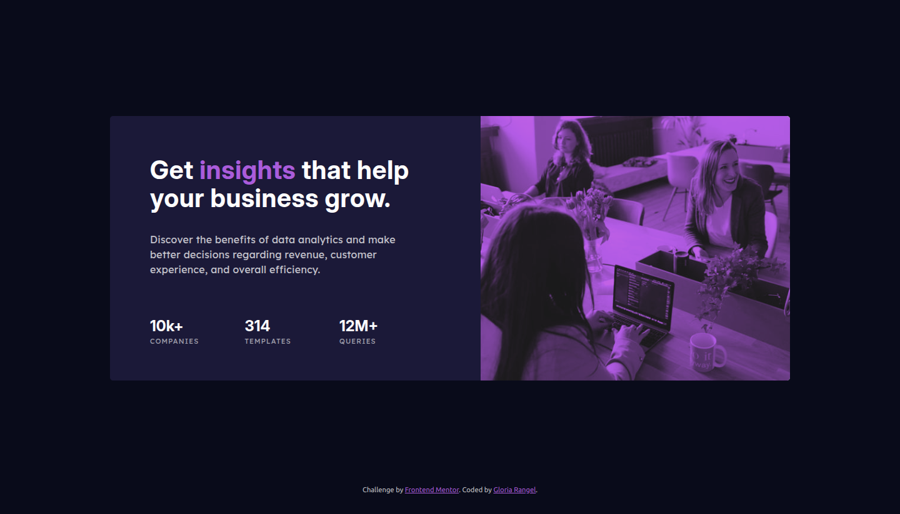
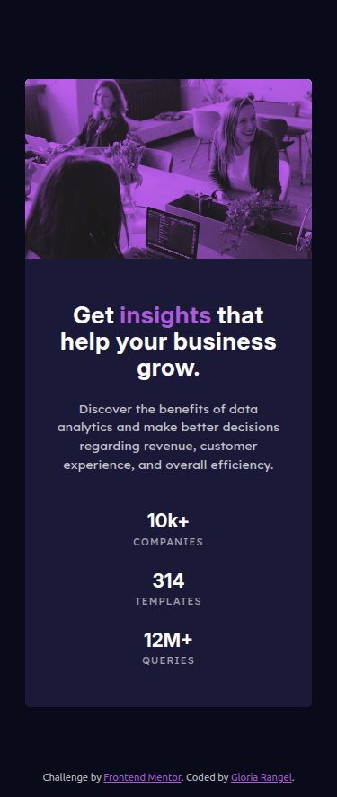

# 🖼  Frontend Mentor - Stats preview card component solution

This is a solution to the [Stats preview card component challenge on Frontend Mentor](https://www.frontendmentor.io/challenges/stats-preview-card-component-8JqbgoU62). Frontend Mentor challenges help you improve your coding skills by building realistic projects. 

##  📋 Table of contents

-  Overview

-  Screenshot

-  Links

-  My process

-  Built with

-  Useful resources

- What I learned

-  Author

-  Thanks

##  📖 Overview

This challenge focuses on enhancing your **HTML** and **CSS** skills by building a card component based on a given design. The task is simple yet effective in helping you practice the fundamentals of layout and styling. Since there is no JavaScript involved, you'll have the opportunity to focus solely on creating a responsive, well-structured design.

The main goal is to replicate the card component as closely as possible to the provided design, making use of **CSS Grid** to ensure the layout adjusts optimally based on different screen sizes. You’ll be able to use any tools or techniques you like to complete the project, so it’s a great opportunity to experiment and refine your skills.

**Key objectives:**

-  Build a card component using HTML and CSS
-  Ensure the component is responsive and adjusts to various screen sizes, leveraging CSS Grid for the layout
-  Focus on creating an accurate visual match to the provided design

###  📸 Screenshot

These are the screenshots of the implemented solution:

-  **🖥️ Desktop version**

-  **📱 Mobile version**

###  ⛓️ Links

-  HTML URL: [index.html](https://github.com/NorimNori/stats-preview-card-component/blob/main/index.html)

-  Styles URL: [styles folder](https://github.com/NorimNori/stats-preview-card-component/tree/main/styles)

-  Live Site URL: [on Netlify](https://stats-preview-card-component-by-gr.netlify.app/)

##  📌 My process

###  🪚 Built with

-  Semantic HTML5 markup

-  SCSS styles

-  Flexbox

-  CSS Grid

-  Mobile-first workflow

-  BEM class naming 

-  Local .ttf font for typography, loaded via @font-face.

###  🔬 What I learned

In this project, I focused on practicing CSS Grid and improving my responsive design skills. I gained a deeper understanding of how to structure layouts effectively using Grid to ensure they adapt seamlessly across different screen sizes. Additionally, I worked with multiple local fonts, learning how to manage and implement them in a clean and efficient way. I also applied SCSS, which allowed me to better organize my styles and take advantage of features like variables and nesting for more maintainable code.

###  📝 Useful resources

-  [Parent Selector](https://sass-lang.com/documentation/style-rules/parent-selector/) -  This documentation on the Sass website explains the Parent Selector (&) in SCSS. It covers how the & symbol can be used to refer to the parent selector in nested rules, making it easier to write more efficient and organized CSS. The guide dives into various use cases, helping developers understand how to leverage the parent selector to create more maintainable and flexible stylesheets.

##  👋 Author

-  LinkedIn - [Gloria Rangel](https://www.linkedin.com/in/gloria-rangel-06b960306/)

-  Frontend Mentor - [@NorimNori](https://www.frontendmentor.io/profile/NorimNori)

##  🌟 Thank You 🌟

Thanks for visiting this repository! I hope you found it useful and inspiring, or it was just a fun time.

A special thanks to [Frontend Mentor](https://www.frontendmentor.io) for the challenge and for being such an amazing platform to learn and grow as a developer.

Have a nice day! 😊
